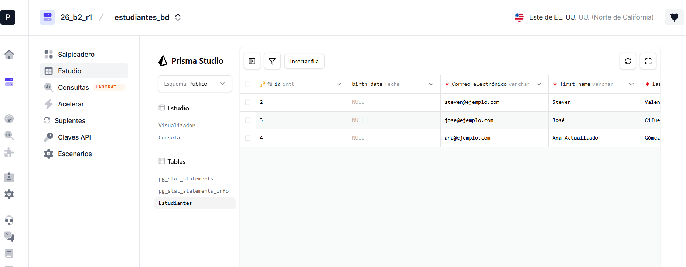
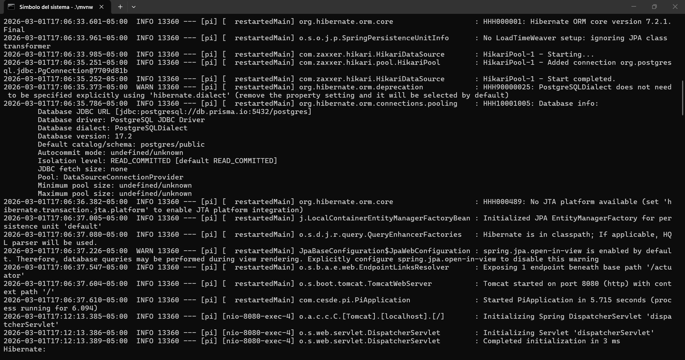
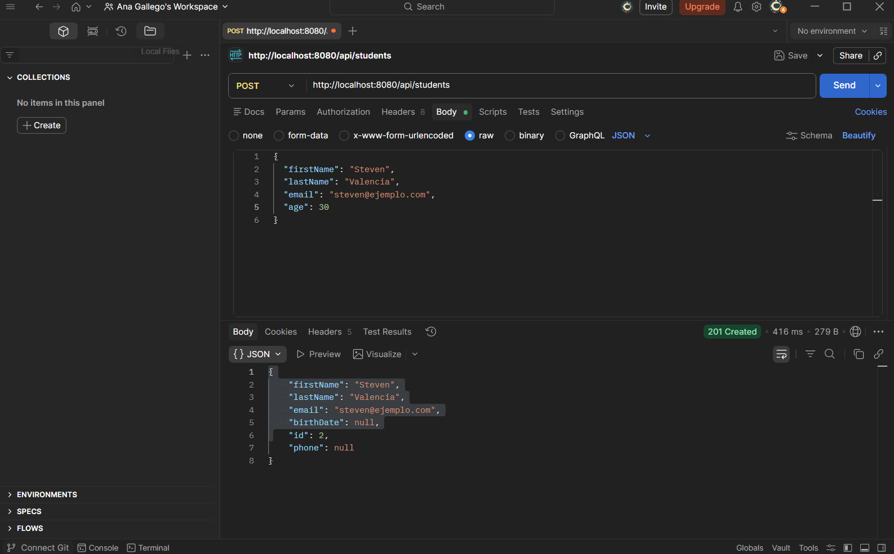
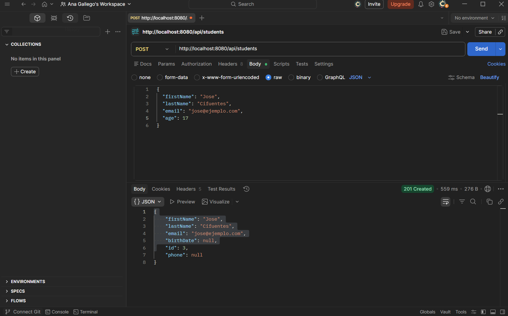
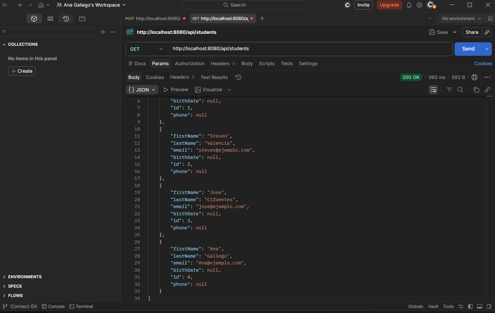
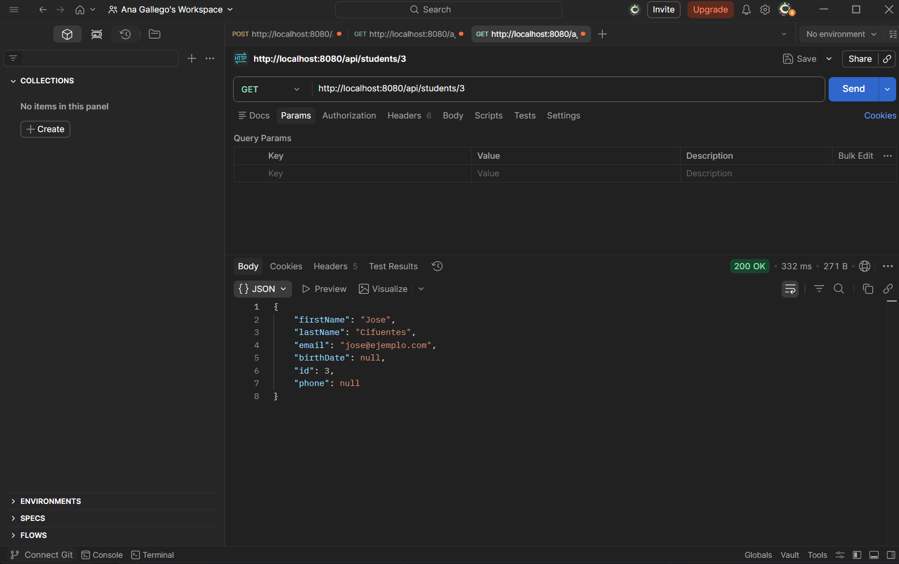
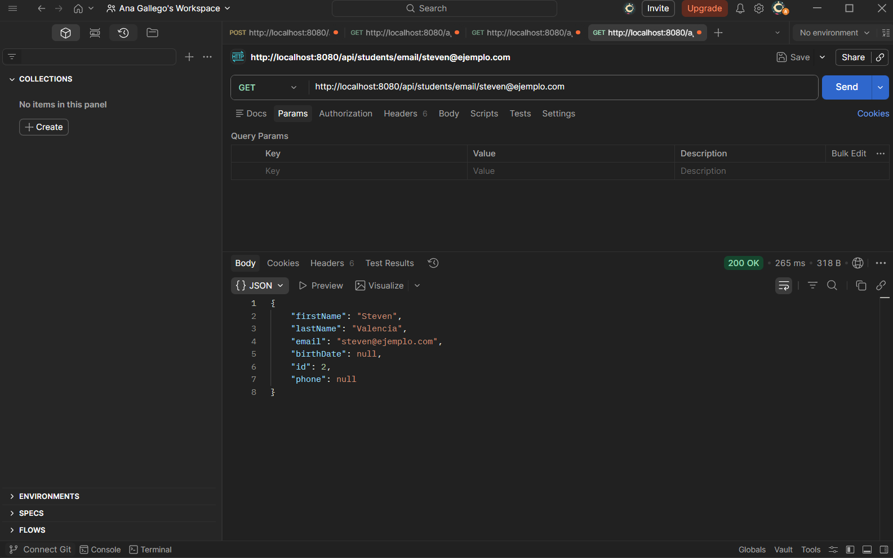
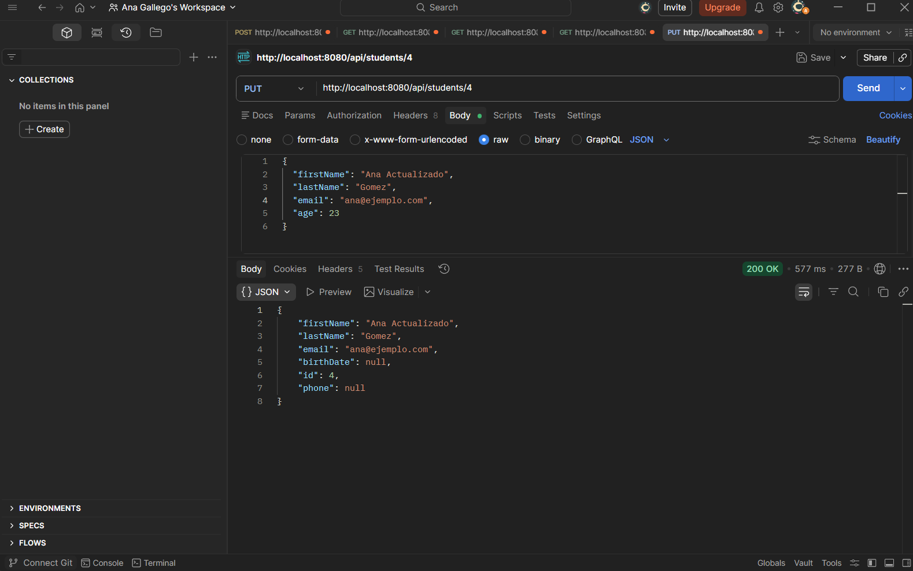
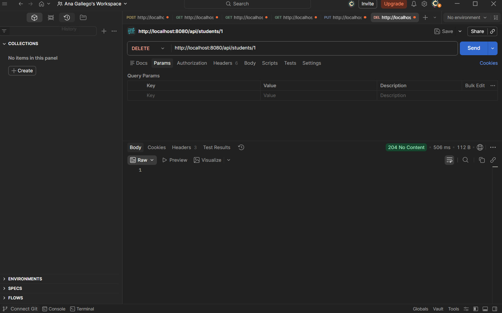
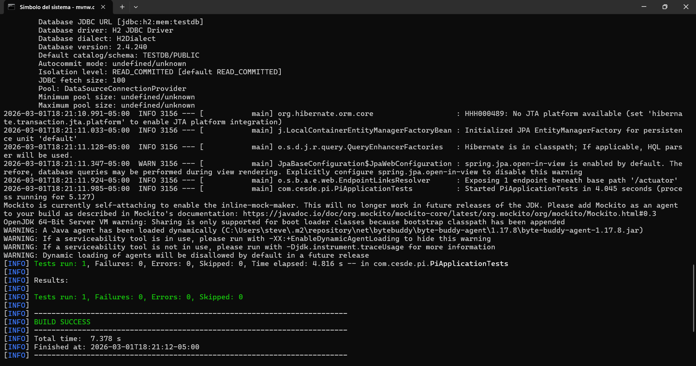

## 1. Título de actividad
Actividad 1 - Configuración y Pruebas de Proyecto Spring Boot

## Estudiante
-Ana Marcela Gallego Gomez

## 2. Enlace a la instancia de base de datos

La instancia de Prisma.io no es pública.
Se adjunta evidencia mediante captura de pantalla de la configuración.

## 3. Configuración base de datos en prisma

## 4. Log de la consola de Spring Boot conexión y ejecución del proyecto

Se evidencia que la aplicación inicia correctamente y establece una conexión exitosa con la base de datos PostgreSQL en Prisma.io.

## 5. Evidencias de las pruebas de la API (CRUD)

## POST
Evidencia de la creación de al menos 3 estudiantes diferentes

# GET ALL
Se muestran todos los estudiantes

# GET by ID
Muestra un estudiante específico por su ID

# GET by email
Muestra un estudiante específico por su correo electrónico

# PUT
Se actualiza la información de un estudiante

# DELETE
Se elimina a un estudiante

## 6. Captura de pantalla del resultado de las pruebas internas

Se ejecutó el comando `./mvnw test`, verificando que todas las pruebas unitarias y de integración pasaron satisfactoriamente sin errores.

